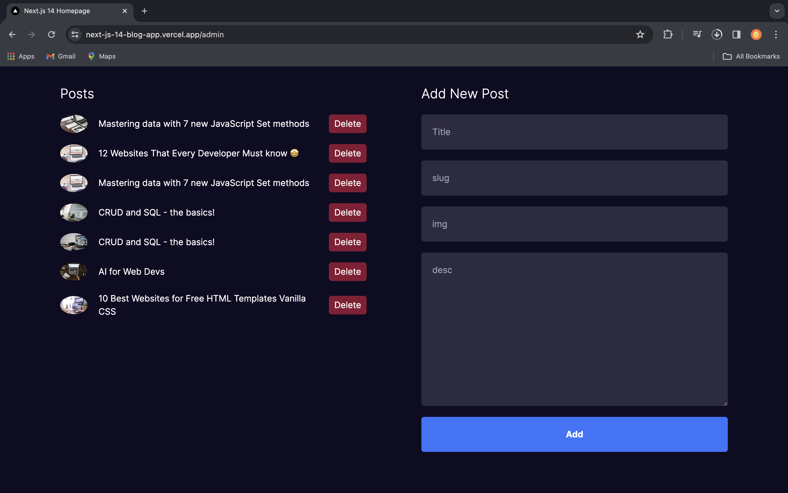
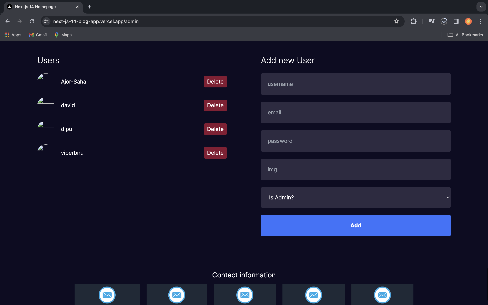
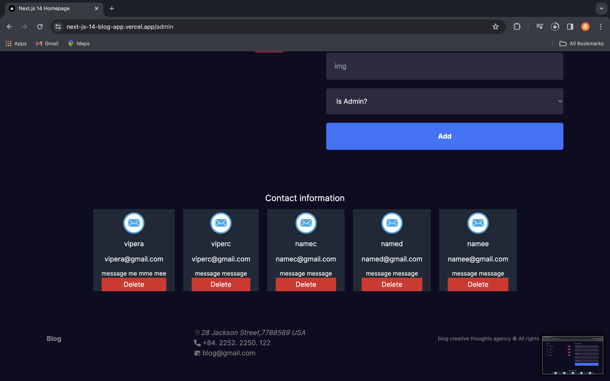

This is a [Next.js](https://nextjs.org/) project bootstrapped with [`create-next-app`](https://github.com/vercel/next.js/tree/canary/packages/create-next-app).

## Getting Started

First, run the development server:

```bash
npm run dev
# or
yarn dev
# or
pnpm dev
# or
bun dev
```

# My Awesome Blog Web App

Welcome to my awesome Next.js full-stack blog web app! This app allows users to browse blogs, read them, and engage with the content. It includes user authentication, GitHub authentication, admin dashboards, blog creation and deletion, user management, and a contact form for users to connect with the admin.

## Features

- **User Authentication:** Users can register, login, and authenticate using NextAuth.js.
- **GitHub Authentication:** GitHub users can seamlessly authenticate to the app.
- **Admin Dashboards:** Admins can create and delete blog posts, manage users, and access contact information.
- **Blog Management:** Users can browse blogs, read them, and admins can create and delete blog posts.
- **Contact Form:** Users can contact the admin via a contact form.

## Tech Stack

- **Frontend:** Next.js, React
- **Backend:** MongoDB, NextAuth.js
- **Authentication:** NextAuth.js, GitHub OAuth
- **Styling:** Tailwind CSS,CSS

## Admin Dashboard Screenshots

<h3>Add post</h3>



<h3>Add user</h3>


<h3>Add user</h3>



1. Clone the repository:

   ```bash
   git clone https://github.com/Ajor-Saha/NextJs-14-Blog-App.git
2. Reference
Lama dev youtube channel
<a>https://youtu.be/vCOSTG10Y4o?si=NNkA-yiCwAqGzmwr</a>
